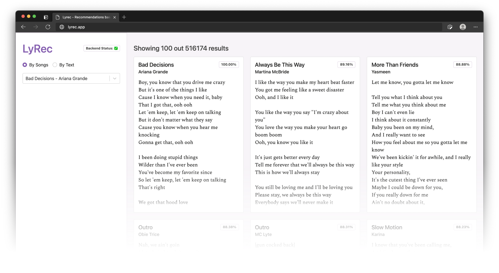

# LyRec
An experiment to see similar songs based on lyrics and explore how it performs as a recommendation engine.

- [Check out our Web App!](https://lyrec.app) It let's you discover similar songs to other songs (by lyrics) or see similar lyrics to any text. Powered by BERT
- [Our Slide Deck.](/slides.pdf) Find out more about how this was made and the answer to the question no one was asking: How good is a recommender engine that recommend songs only based on lyrics.

## Files and Folders
- [`LyRec.ipynb`](/LyRec.ipynb) Jupyter Notebook used to clean the datasets and generate BERT embeddings for all the songs
- [`user_songs.ipynb`](/user_songs.ipynb) Jupyter Notebook used to make an lyrics based recommendation engine and evaluate it's performance
- [`backend/`](/backend) Code for our FastAPI based backend. Also contains AWS deployment instructions and a Dockerfile
- [`frontend/`](/frontent) Code for the Next.JS based UI and clientside stuff. It is hosted on Vercel

## Developers
- Aditya Pethe ([@aditya-pethe](https://github.com/aditya-pethe))
- George Thayamkery ([@geooot](https://github.com/geooot))
- Nathan Read ([@nathancread](https://github.com/geooot))